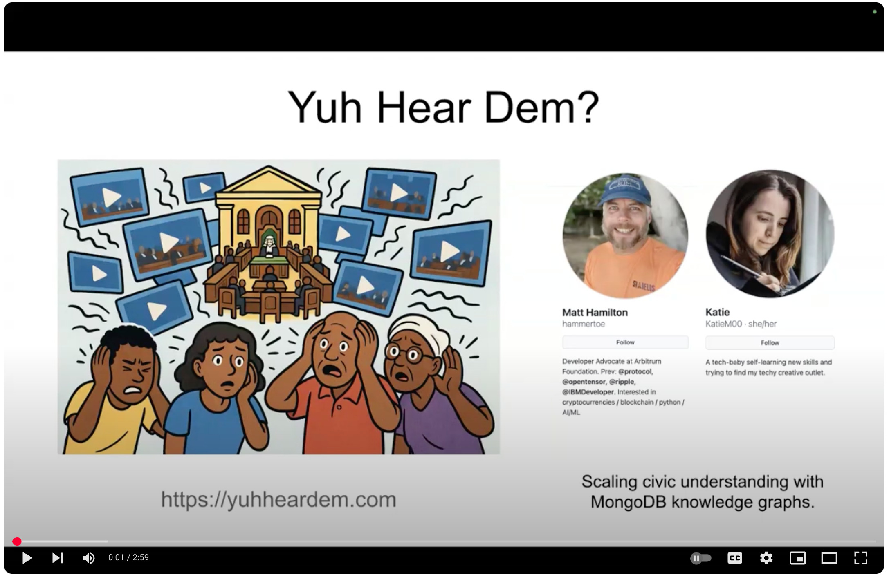
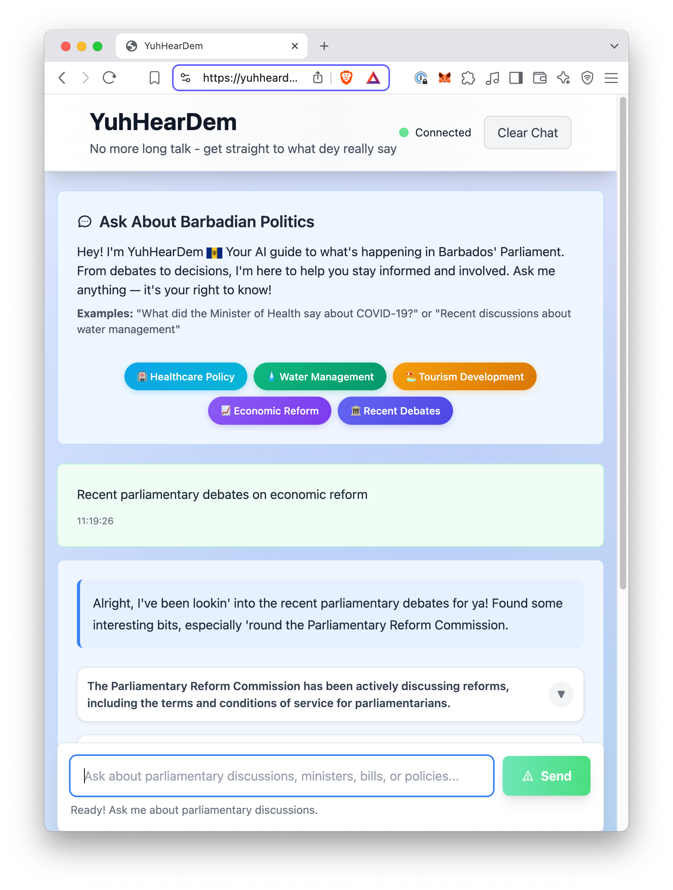
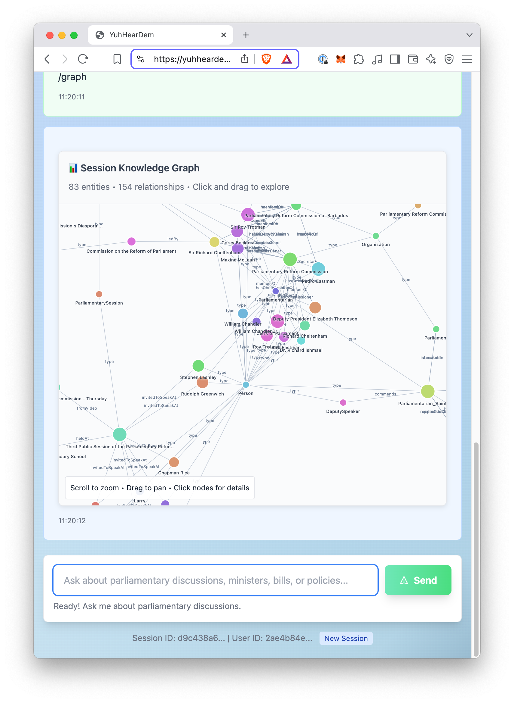

# 🗣️ YuhHearDem

**YuhHearDem** is a conversational AI tool that makes Barbados Parliament YouTube videos **searchable**, **context-aware**, and **transparent**. Ask natural-language questions like:

> "What did the Minister of Health say about the sugar tax?"

And get timestamped, grounded answers — linked directly to parliamentary footage.

This was submitted to the [AI in Action Hackathon](https://devpost.com/software/yuh-hear-dem).

---

## 🎥 Demo Video & Live Site

[](https://www.youtube.com/watch?v=kLPxpGwY6HQ)

🔗 **Live Site:** [https://yuhheardem.com](https://yuhheardem.com)

---

## 🖼️ Screenshots

<div align="center">
  
  
</div>

---

## 🚀 What It Does

- Ingests and cleans up raw parliamentary transcripts from YouTube
- Generates a **knowledge graph** using Google Gemini
- Stores data and vector embeddings in **MongoDB Atlas**
- Powers a **GraphRAG-style hybrid retrieval system**
- Offers a **conversational UI** built on **Google ADK**

---

## 📁 Repository Structure

```

.
├── chatbot/       # Main chat system (frontend, ADK backend, LLM interface)
├── mcp/           # Prototype MCP server used during development
├── scripts/       # Tools to process and load transcript + video data
├── \_images/       # Screenshots and media for README/docs
├── requirements.txt
└── README.md

````

---

## 🧰 Getting Started (Local Development)

Want to run YuhHearDem locally for testing or development? Here's how to set up a local instance on your machine.

> 🛠️ **Note:** These steps are for developers. For the live version, visit [yuhheardem.com](https://yuhheardem.com)

### 1. Clone the Repository

```bash
git clone https://github.com/YOUR_USERNAME/yuhheardem.git
cd yuhheardem
````

### 2. Set Up the Python Environment

We recommend using `venv`:

```bash
python3 -m venv venv
source venv/bin/activate  # or venv\Scripts\activate on Windows
```

Then install dependencies:

```bash
pip install -r requirements.txt
```

### 3. Configure Environment Variables

Create a `.env` file in the project root (or export directly in your shell). You'll need:

```
MONGODB_CONNECTION_STRING=<your MongoDB Atlas URI>
GEMINI_API_KEY=<your Google Gemini API key>
```

These are used by the chatbot and data loader.

### 4. Run the Chatbot Interface

```bash
cd chatbot
python webmain.py
```

This starts the **local chat interface** powered by FastAPI and Google ADK. By default, it will be available at:

```
http://localhost:8000
```

### 5. Load Transcript Data (Optional)

If you want to load your own data or replay the Barbados Parliament transcripts, run:

```bash
cd scripts
python load_transcripts.py --source path/to/video_data/
```

This will clean transcripts, generate vector embeddings, and load the knowledge graph into MongoDB.

---

## 🧠 Built With

* [Google Gemini](https://ai.google.dev/gemini) — for transcript cleanup and graph generation
* [MongoDB Atlas](https://www.mongodb.com/atlas) — for graph and vector storage
* [Google ADK](https://github.com/google/agent-development-kit) — conversational agent infrastructure
* Python, FastAPI, TailwindCSS, and more

---

## 👨‍👧 A Family Hackathon Project

This was built by **Matt** (in Barbados) and **Katie** (in the UK) — a father–daughter duo — and submitted on **Father’s Day ❤️**.
It began as a learning project for Katie and became a powerful civic tool.

---

## 📌 What's Next

* Index Prime Minister's Office and government bills
* Real-time tracking of political stances across sessions

---

## 📜 License

MIT — remix, reuse, and help make civic data accessible.

> Transparency is a team sport.

